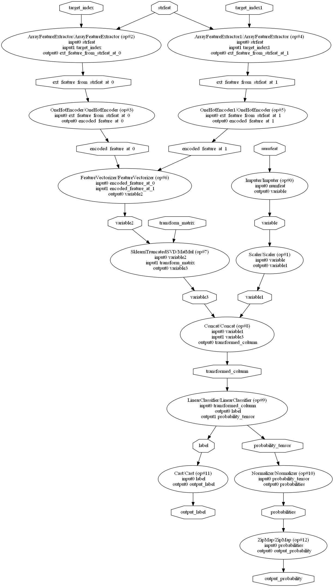

==================
Convert a pipeline
==================

.. contents::
    :local:

*skl2onnx* converts any machine learning pipeline into
*ONNX* pipelines. Every transformer or predictors is converted
into one or multiple nodes into the *ONNX* graph.
Any `ONNX backend <https://github.com/onnx/onnx/blob/master/docs/ImplementingAnOnnxBackend.md>`_
can then use this graph to compute equivalent outputs for the same inputs.

.. _l-complex-pipeline:

Convert complex pipelines
=========================

*scikit-learn* introduced
`ColumnTransformer <https://scikit-learn.org/stable/modules/generated/sklearn.compose.ColumnTransformer.html>`_
useful to build complex pipelines such as the following one:

::

    numeric_features = [0, 1, 2] # ["vA", "vB", "vC"]
    categorical_features = [3, 4] # ["vcat", "vcat2"]
    
    classifier = LogisticRegression(C=0.01, class_weight=dict(zip([False, True], [0.2, 0.8])),
                                    n_jobs=1, max_iter=10, solver='lbfgs', tol=1e-3)

    numeric_transformer = Pipeline(steps=[
        ('imputer', SimpleImputer(strategy='median')),
        ('scaler', StandardScaler())
    ])

    categorical_transformer = Pipeline(steps=[
        ('onehot', OneHotEncoder(sparse=True, handle_unknown='ignore')),
        ('tsvd', TruncatedSVD(n_components=1, algorithm='arpack', tol=1e-4))
    ])

    preprocessor = ColumnTransformer(
        transformers=[
            ('num', numeric_transformer, numeric_features),
            ('cat', categorical_transformer, categorical_features)
        ])

    model = Pipeline(steps=[
        ('precprocessor', preprocessor),
        ('classifier', classifier)
    ])

Which we can represents as:

.. blockdiag::

    blockdiag {
        orientation=portrait;
        features -> numeric_features;
        features -> categorical_features;
        numeric_features -> SimpleImputer -> StandardScaler -> LogisticRegression;
        categorical_features -> OneHotEncoder -> TruncatedSVD -> LogisticRegression;
    
        group {
            numeric_features; SimpleImputer; StandardScaler;
        }
        group {
            categorical_features; OneHotEncoder; TruncatedSVD;
        }    
    }

Once fitted, the model is converted into *ONNX*:

::

    initial_type = [('numfeat', FloatTensorType([1, 3])),
                    ('strfeat', StringTensorType([1, 2]))]
    model_onnx = convert_sklearn(model, initial_types=initial_type)

It can be represented as a 
`DOT <https://en.wikipedia.org/wiki/DOT_(graph_description_language)>`_ graph:

::

    from onnx.tools.net_drawer import GetPydotGraph, GetOpNodeProducer
    pydot_graph = GetPydotGraph(model_onnx.graph, name=model_onnx.graph.name, rankdir="TP",
                                node_producer=GetOpNodeProducer("docstring"))
    pydot_graph.write_dot("graph.dot")

    import os
    os.system('dot -O -Tpng graph.dot'

Parser, shape calculator, converter
===================================

.. index:: parser, shape calculator, converter

Three kinds of functions are involved into the conversion
of a *scikit-pipeline*. Each of them is called in the following
order:

* **parser(scope, model, inputs, custom_parser)**:
  the parser builds the expected outputs of a model,
  as the resulting graph must contain unique names,
  *scope* contains all names already given,
  *model* is the model to convert,
  *inputs* are the *inputs* the model receives
  in the *ONNX* graph. It is a list of
  :class:`Variable <skl2onnx.common._topology.Variable>`.
  *custom_parsers* contains a map ``{model type: parser}``
  which extends the default list of parsers.
  The parser defines default outputs for standard
  machine learned problems. The shape calculator
  changes the shapes and types for each of them
  depending on the model and is called after all
  outputs were defined (topology). This steps defines
  the number of outputs for every node and sets them to
  a default type and default shape ``[1, 'None']``
  which the output node has one row and no known
  columns yet.
* **shape_calculator(model):**
  The shape calculator changes the shape and types
  of the outputs created by the parser. Once this function
  returned its results, the graph structure is fully defined
  and cannot be changed.
* **converter(scope, operator, container):**
  The converter converts the transformers or predictors into
  *ONNX* nodes. Each node can an *ONNX*
  `operator <https://github.com/onnx/onnx/blob/master/docs/Operators.md>`_ or
  `ML operator <https://github.com/onnx/onnx/blob/master/docs/Operators.md>`_ or
  custom *ONNX* operators.
  
As *sklearn-onnx* may convert pipelines with model coming from other libraries,
the library must handle parsers, shape calculators or converters coming
from other packages. This can be done is two ways. The first one
consists in calling function :func:`convert_sklearn <skl2onnx.convert_sklearn>`
by mapping the model type to a specific parser, a specific shape calculator
or a specific converter. It is possible to avoid these specifications
by registering the new parser or shape calculator or converter
with one of the two functions
:func:`update_registered_converter <skl2onnx.update_registered_converter>`,
:func:`update_registered_parser <skl2onnx.update_registered_parser>`.
One example follows.

.. _l-register-converter:

New converters in a pipeline
============================

Many libraries implement *scikit-learn* API and their models can
be included in *scikit-learn* pipelines. However, *sklearn-onnx* cannot
a pipeline which include a model such as *XGBoost* or *LightGbm*
if it does not know the corresponding converters: it needs to be registered.
That's the purpose of function :func:`skl2onnx.update_registered_converter`.
The following example shows how to register a new converter or
or update an existing one. Four elements are registered:

* the model class
* an alias, usually the class name prefixed by the library name
* a shape calculator which computes the type and shape of the expected outputs
* a model converter

The following lines shows what these four elements are for a random forest:

::

    from onnxmltools.convert.common.shape_calculator import calculate_linear_classifier_output_shapes
    from skl2onnx.operator_converters.RandomForest import convert_sklearn_random_forest_classifier
    from skl2onnx import update_registered_converter
    update_registered_converter(SGDClassifier, 'SklearnLinearClassifier',
                                calculate_linear_classifier_output_shapes,
                                convert_sklearn_random_forest_classifier)

See example :ref:`example-lightgbm` to see a complete example
with a *LightGbm* model.

Titanic example
===============

The first example was a simplified pipeline coming from *scikit-learn*'s documentation:
`Column Transformer with Mixed Types <https://scikit-learn.org/stable/auto_examples/compose/plot_column_transformer_mixed_types.html#sphx-glr-auto-examples-compose-plot-column-transformer-mixed-types-py>`_.
The full story is available in a runable exemple: :ref:`example-complex-pipeline`
which also shows up some mistakes that a user could come accross
when trying to convert his pipeline.

Parameterize the conversion
===========================

Most of the converter do not require specific options
to convert a *scikit-learn* model. It always produces the same
results. However, in some cases, the conversion cannot produce
a model which returns the exact same results. The user may want
to optimize the conversion by giving the converter additional
information, even if the model to convert is included in a
pipeline. That why the option mechanism was implemented:
:ref:`l-conv-options`.
